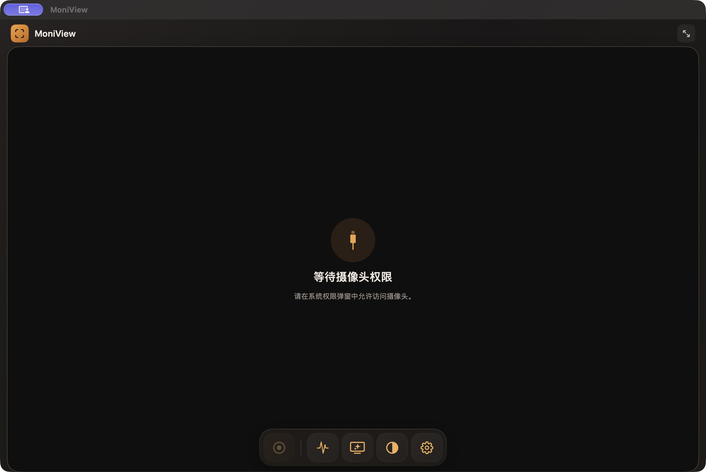
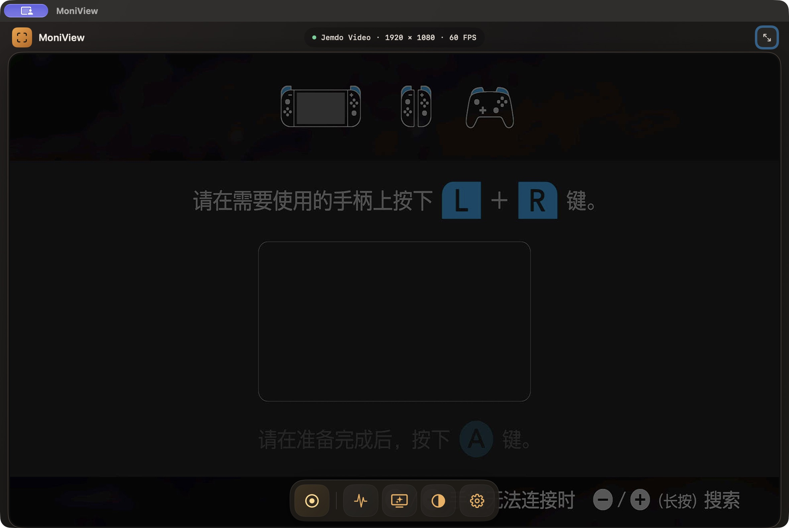

<div align="center">

# MoniView

**A native, lightweight UVC / HDMI capture card monitor for macOS.**

Live preview, audio monitoring, recording, color tools, and MetalFX spatial scaling, built on SwiftUI, AVFoundation, Metal, Core Image, and VideoToolbox with no third-party runtime dependencies.

**English · [简体中文](README.zh-CN.md)**


[](LICENSE)

</div>

> **Status: early preview (0.2.0).** MoniView is a local developer build with ad-hoc signing. It is not notarized and is not on the Mac App Store. It targets macOS 14 or later. The interface follows the system language: English or Simplified Chinese.

MoniView turns a USB (UVC) capture card into a low-latency monitor window for an HDMI source: a camera, a console, or any other HDMI output.

## What it does

- Enumerates the formats the device actually reports, including discrete steps and fractional rates such as 29.97 and 59.94 FPS.
- Keeps the preview low-latency: only the newest frame is retained, and capture, GPU rendering, audio, and video encoding run on separate queues with at most one preview GPU frame in flight.
- Monitors the capture card's audio input in real time with a level meter.
- Records H.264 video with AAC audio to a `.mov` file.
- Adjusts color and sharpening: brightness, contrast, saturation, vibrance, and highlight recovery.
- Scales the preview on the GPU with MetalFX, with a Lanczos compatibility fallback. On macOS 26+, Apple's low-latency ML super-resolution scaler is available as an optional method.
- Writes a diagnostics snapshot on the local machine only.

## Screenshots





These screenshots show the actual app connected to a Jemdo Video capture card. On-screen values depend on the connected device and are not performance benchmarks.

## Build and run

```sh
swift build -c release
./Scripts/build-app.sh
open build/MoniView.app
```

Only the Swift toolchain is needed; the Xcode Command Line Tools are enough and no Xcode project or full IDE is required. `Scripts/build-app.sh` wraps the SwiftPM release binary into `build/MoniView.app` with `Resources/MoniView.icns`, the bundled `PrivacyInfo.xcprivacy`, and an ad-hoc signature.

The optional AI path requires an Apple Swift 6.2+ / macOS SDK 26+ build and supported macOS 26+ hardware at runtime. Older Apple compilers build the spatial fallback; the deployment target remains macOS 14. A custom new compiler paired with an old SDK can explicitly package the fallback with `MONIVIEW_DISABLE_AI=1 ./Scripts/build-app.sh`. See [AI engineering notes](docs/AI_UPSCALING.md).

The script takes optional overrides: `MONIVIEW_VERSION`, `MONIVIEW_BUILD`, `MONIVIEW_ARCH`, `MONIVIEW_SIGN_IDENTITY`, `MONIVIEW_DISABLE_AI=1`, and `MONIVIEW_ENTITLEMENTS=1` to sign with `Resources/MoniView.entitlements` and the hardened runtime for sandbox verification. It verifies the signature, checks the bundled resources, and prints the architecture and version.

On first launch, grant camera access for video. Microphone permission is needed only to monitor or record audio, including the capture card's audio input; video-only monitoring does not require it. MoniView auto-selects the USB video device and a matching audio input, and other inputs can be chosen in settings.

The bottom buttons are Record, Info, Quality, Color, and Settings. A click on the image closes the open panel.

**Window > Always on Top** keeps the preview above normal windows and remembers the choice across launches. Native full screen temporarily uses the normal window level; leaving full screen restores the saved preference. It does not change Spaces behavior or raise save panels and other app windows.

The brief status line shows the device name, the actual buffer resolution, and the measured FPS. In window mode it sits centered along the top; in full screen it moves to the top left. The detailed info card opens at the top right, and while it is open the brief line is hidden and restored when the card closes. The brief line defaults to hidden and can be enabled with **Show device status** in settings. The enhancement label is separately controlled by **Show enhancement status**, also off by default; existing preferences are preserved.

**画面比例** (Aspect) sets how the image fills the window: **适应画面** (fit) shows the whole image, **填满窗口** (fill) keeps the ratio and crops the overflow, and **拉伸填满** (stretch) fills the window and may distort the ratio.

Shortcuts: `⌘S` save the current frame, `⌘R` record/stop, `⌘⇧M` mute monitoring, `⌘I` show or hide the info card, `⌘,` open settings, `⌃⌘F` or a double-click on the image to toggle native full screen, and `Esc` to close a panel or leave full screen. In full screen, the buttons and cursor hide after three seconds of inactivity and reappear on movement.

## Save the current frame

Choose **File > Save Current Frame…** (`⌘S`) to save a PNG named `MoniView-YYYYMMDD-HHmmss.png` by default. The frame and picture settings are captured when you invoke the command, not when you finish choosing the destination. PNG processing and writing run off the capture/render queues; only one save operation is allowed at a time.

The PNG contains the whole source-resolution frame with the current color adjustments and source-resolution sharpening, using the same `VideoImageProcessor.recordedImage` path as processed recording. It does not include AI/MetalFX scaling, fit/fill/stretch presentation, or on-screen controls. The recording-only **Record color and sharpening** switch does not disable picture processing for snapshots. Cancelling the save panel writes nothing; replacement writes are atomic. No signal disables the command.

## Preview and frame rate

MoniView sets both the device and the video connection frame duration, so a device configured for 60 FPS is not left with a connection still running at 20. When the resolution changes and the current frame rate is not supported, it uses the highest rate the new format offers.

The info card reports the actual buffer size and pixel format, capture and render frame rates, audio level, and software processing time. That time spans the video callback through the GPU completion callback, before the final main-thread hop; it does not include HDMI device, capture card, or display scan-out latency. Repainting the same captured frame for a settings change is not counted as another video frame. Capture drops and recording omissions are separate counters.

When the window is minimized or fully occluded by another window, preview rendering pauses while capture, recording, and audio monitoring continue.

See [performance notes](docs/PERFORMANCE.md) for the pipeline, observed device samples, and measurement limits.

## Honest upscaling

MetalFX is a spatial upscaler that needs no multi-frame history, so it cannot create detail the capture signal never contained. The optional AI method uses Apple's on-device low-latency super-resolution model (macOS 26+); it reconstructs plausible detail per frame, but it is still not the capture's true resolution. Experimental interpolation is a separate, off-by-default preview feature; see the interpolation section below.

- **AI super-resolution** uses Apple's VTLowLatencySuperResolutionScaler on macOS 26 or later, falling back to MetalFX/Lanczos while the model loads, when unsupported, or when no supported factor fits the processing-size cap. Check the actual engine in the info card.
- **MetalFX** uses the system spatial upscaler on supported GPUs.
- **Lanczos** is the compatibility path, used automatically when the device does not support MetalFX or the requested scale exceeds its current limits.
- Targets are original, 1080p (long edge 1920), 2K (long edge 2560), 4K (long edge 3840), and Match Display. Other aspect ratios keep their own ratio. Match Display uses the display's backing-store size; scaled desktop modes do not guarantee a one-to-one mapping to physical panel pixels.

In low latency mode the target is an upper bound on processing size, additionally bounded by the visible image size. Thus 2K and 4K may resolve to the same processing size. The info card shows the size actually produced. With vsync off, tearing is possible; turning low latency off restores display synchronization and full target-size processing. Neither mode changes the capture input resolution.

These options affect the live preview only.

## Recording

By default a recording includes the selected color adjustments and sharpening at the original resolution. It does not include GPU scaling or the on-screen UI. Because sharpening is applied at the source resolution while the preview may sharpen after MetalFX or Lanczos scaling, a recording is not a pixel-for-pixel copy of the scaled preview. Turn off **录制预览色彩和锐化** (Record color and sharpening) in settings to save the untouched source instead. H.264 encoding uses the system encoder through AVFoundation, which may be a hardware or software encoder; a hardware encoder is not guaranteed. Audio (when present) is AAC, and the container is `.mov`.

Recording audio uses one FIFO capped at approximately two seconds of media (and timestamp span), with a secondary packet-count safety limit. Temporary encoder backpressure retains audio in order; over-budget audio is discarded oldest-first and counted. Source timestamps are preserved. Stopping allows up to two seconds for the audio tail to drain before reporting any remaining drops; MOV finalization follows separately. This is a recording buffer, not an added audio-monitoring delay. The queue's standalone checks run with `./Scripts/test-audio-buffer.sh`; live audio continuity and encoder backpressure still require a capture-card test.

## Measured device limits

On the development machine, a Jemdo Video USB capture device exposed a highest capture format of 1920×1080 at about 60 FPS, and no 4K capture entry was present. HDMI input or passthrough capability and the USB capture output capability can differ; follow the formats the device actually reports. Other capture cards still need to be verified on their own hardware.

This is what one device reported under test, not a general performance claim.

## Privacy

Camera access is required to read video from the UVC capture card. Microphone access is only required to monitor or record audio. MoniView runs entirely on the local machine, collects nothing, and sends nothing to any external service. The app bundles a privacy manifest (`PrivacyInfo.xcprivacy`) that declares no tracking and no collected data. Exported media is written to the file you choose in the save panel, and the diagnostics snapshot is written to `~/Library/Logs/MoniView/diagnostics.json`; both stay local. Capture card serial numbers, device identifiers, and diagnostic logs can be personally identifying, so do not attach them to public issues. See [docs/PRIVACY.md](docs/PRIVACY.md) for the full statement.

## Platform and roadmap

MoniView is macOS only today. It is built as an ad-hoc signed local app, not a notarized or Mac App Store build, so the current artifact is not Store-submittable; see [docs/APP_STORE.md](docs/APP_STORE.md) for the distribution checklist and the remaining gaps. An iPad version would need a separate UIKit touch target, audio playback adaptation, and its own signing; a Mac `.app` cannot be installed on iPad. The iOS version is not part of this repository, and later versions may be closed source. Existing releases keep the license they shipped with.

The planned direction is shared media/model code with small native platform shells, not a larger desktop control panel. Existing reusable seams and remaining platform dependencies are documented in [platform boundaries](docs/PLATFORM_BOUNDARIES.md); no iPad target is implemented by this review.

## References

Reference material for the capture and rendering approach. No third-party code was copied. OBS Studio is licensed GPL-2.0-or-later; its source was reviewed for design ideas, but no code was copied.

- Apple: [Technical Note TN2445 — Handling Frame Drops with AVCaptureVideoDataOutput](https://developer.apple.com/library/archive/technotes/tn2445/_index.html)
- Apple: [CAMetalLayer](https://developer.apple.com/documentation/QuartzCore/CAMetalLayer) and [nextDrawable()](https://developer.apple.com/documentation/QuartzCore/CAMetalLayer/nextDrawable())
- OBS Studio: [mac-avcapture plugin](https://github.com/obsproject/obs-studio/tree/master/plugins/mac-avcapture) (GPL-2.0-or-later)

## Contributing

See [CONTRIBUTING.md](CONTRIBUTING.md) for build and privacy ground rules, and [CHANGELOG.md](CHANGELOG.md) for release history. A build-only workflow is available for manual runs; it is not triggered on push or pull request.

The [engineering review](docs/REVIEW.md) separates submitted fixes from hardware-dependent work. The [local AI handoff](docs/LOCAL_AI_HANDOFF.md) gives integration, build, failure-injection, and real-device acceptance steps. Source review and Linux tests are not a macOS build or a performance certification.

## License

All rights reserved. Source is published for viewing; use, modification and redistribution require prior written permission. See [LICENSE](LICENSE). Earlier MIT releases retain their original permissions. Public visibility does not make this an open-source license; GitHub viewing/forking rights still apply.

### Native validation

See [the local validation record](docs/LOCAL_VALIDATION.md) for the tested Mac, capture device, build commands and remaining gaps. The device chooses from its advertised formats and precise rates; switching audio reasserts the requested video format. Compatibility with every UVC card is not certified. A 4K HDMI input specification is not proof of 4K USB capture; processing targets do not change capture resolution.

### Experimental frame interpolation

Off by default on supported macOS 26+ hardware. A separate Off/2× selector and Low/Medium/High quality tiers target 2× preview FPS; a Flow Beta tier runs the app's own Metal optical-flow engine (no model weights, no third-party runtime) at far lower measured cost than the VideoToolbox processor. Automatic mode checks processing cost; the optional force switch ignores the cost budget, while preserving display eligibility, deadlines and resource bounds. Source endpoints and Clear midpoints can use MetalFX/Lanczos scaling; Smooth midpoints use one lighter final resize. Standalone AI upscaling is suspended while interpolating and resumes eligibility when interpolation is off. Interpolation itself leaves capture/recording FPS unchanged. See [dimension, latency, resource and validation boundaries](docs/FRAME_INTERPOLATION.md).

Capture FPS describes frames delivered by the selected device, not a game's internal render rate. Selecting 30 FPS limits the capture stream and cannot control the source console. Follow estimates cadence only from exact adjacent-frame repeats, when Follow or duplicate skipping is enabled; static scenes, compressed/noisy repeats, and a capture rate already reduced to the content rate can leave it unavailable. Follow waits for a stable estimate, changes only the Mac's capture rate, and pauses while recording; a later source speedup must be selected manually. This is not game-FPS telemetry. This release has no ScreenCaptureKit input backend. See [input and interpolation limits](docs/FRAME_INTERPOLATION.md).
